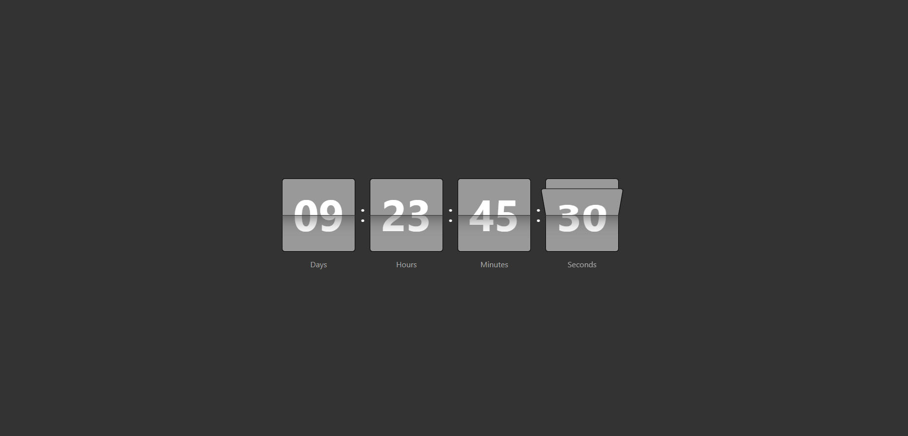

# goit-js-hw-11-timer



## как использовать плагин таймера?

### Для просмотра демо версии таймера переходите по этой [ссылке](https://imykhailychenko.github.io/goit-js-hw-11-timer/homework/index.html)

Подключите основной файл с кодом к своему html файлу
```JavaScript
<script src="./script.js" type="module"></script>
```

После этого, вставьте следующую html разметку
```JavaScript
<div id="любое название id"></div>
```

Вы можете создавать любое количество таймеров на странице
просто передавая разные id
```JavaScript
<div id="timer-1"></div>
<div id="timer-2"></div>
...
<div id="timer-n"></div>
```

После этого, в вашем JavaScript файле для каждого отдельного таймера на странице
вызывайте свой экземпляр класса передавая в параметры id(selector), который вы указали в
разметке, а так же параметры даты(targetDate), к которой ведёться отсчёт.

```JavaScript
new CountdownTimer({
  selector: '#timer-1',
  targetDate: new Date('2019 Dec 28 23:18:50'),
});
```
